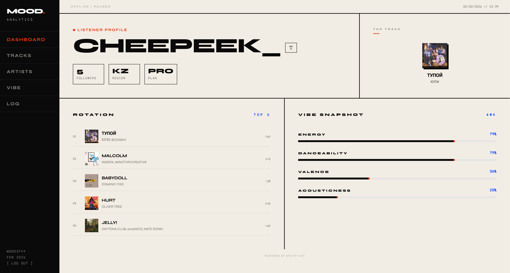
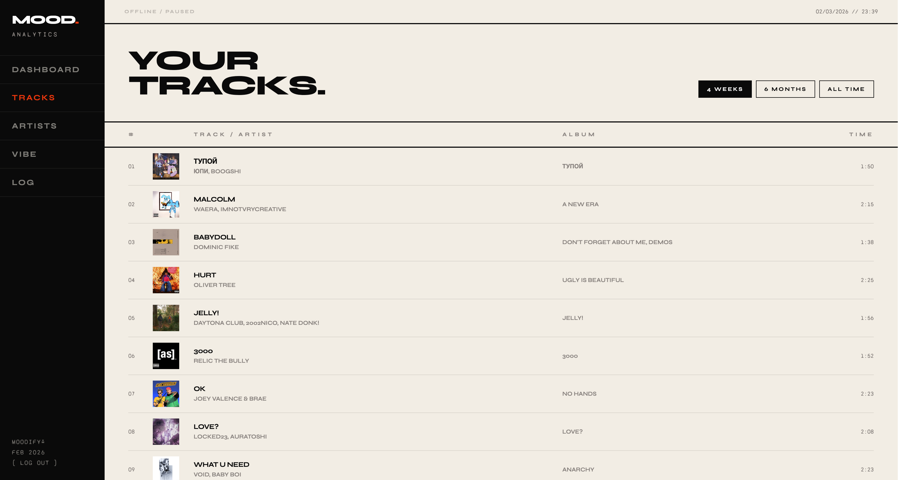
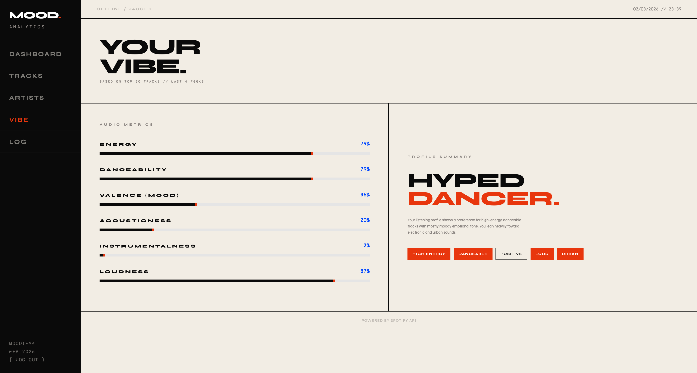
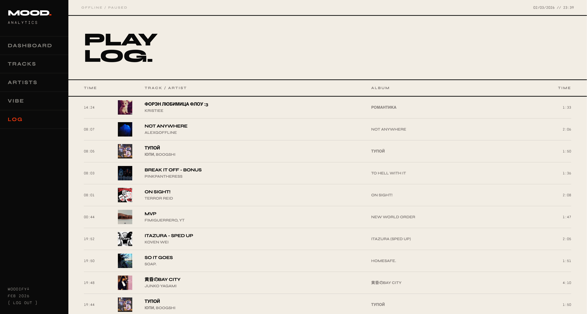

# MOOD (Moodify)

A sleek, modern music dashboard built with React that visualizes your Spotify listening habits.

---

## 📸 Screenshots

### Dashboard


### Your Tracks


### Your Artists


### Your Vibe


### Play Log


---

## Features

- **Top Tracks**: View your most played tracks over the last 4 weeks, 6 months, and all time.
- **Top Artists**: Discover your favorite artists.
- **Vibe Analysis**: Visual radar chart analyzing the energy, danceability, and positivity of your music.
- **Play History**: See what you've been listening to recently.

---

## Tech Stack

- React 18 + Vite
- Tailwind CSS
- React Router v6
- Recharts
- Spotify Web API (OAuth 2.0 PKCE)

---

## Getting Started

### Prerequisites

You need a Spotify account and a [Spotify Developer App](https://developer.spotify.com/dashboard).

### Installation

1. **Clone the repository**:

```bash
git clone https://github.com/chpkc/MOOD.git
cd MOOD
```

2. **Install dependencies**:

```bash
npm install
```

3. **Configure Spotify App**:
   - Go to [Spotify Developer Dashboard](https://developer.spotify.com/dashboard).
   - Create a new app.
   - In the app settings, add the following **Redirect URIs**:
     - Local development: `http://localhost:5173/callback`
     - Production (if deployed): `https://chpkc.github.io/MOOD/callback`

4. **Set up Environment Variables**:
   - Create a `.env` file in the root directory.
   - Add your Client ID from the Spotify Dashboard:

```env
VITE_SPOTIFY_CLIENT_ID=your_spotify_client_id_here
```

5. **Run the project**:

```bash
npm run dev
```

---

## Deployment

To deploy to GitHub Pages:

1. Update the `base` in `vite.config.js`.
2. Run:

```bash
npm run deploy
```
